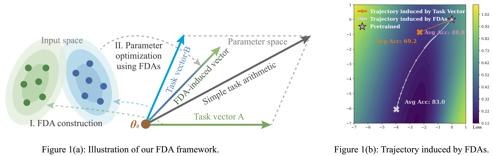

# Model Merging with Functional Dual Anchors
This repository is the official PyTorch implementation of “Model Merging with Functional Dual Anchors”, by Kexuan Shi, Yandong Wen, Weiyang Liu.

([arxiv](https://arxiv.org/pdf/2401.07402.pdf))

<p align="center">
  
</p>


## Introduction
***Model Merging*** has been an intriguing post-training strategy for integrating knowledge from mutliple finetuned checkpoints of a shared foundation model. Existing methods focuses on the operation in the parameter space, i.e, combing task vectors to mitgate knowledge confilctsm, thereby remain constrained by the complexity of the parameter space. In this work, we propose ***Functional Dual Anchors (FDAs)***, a framework (Figure 1(a)) that instead models the knowledge in the input-representation space. Specifically, FDAs are synthetic inputs whose induced gradients align with task vectors, capturing task-specific functional shifts relative to the pretrained model. Then, we use the FDAs to adapt the pretrained model. Comparing with the task vectors, FDAs can provide more robust and flexible trajectory for model merging, as shown in the Figure 1(b).
FDAs provide an alternative perspective on model merging by extending input-space modeling to this setting and bridges joint multi-task training and post-hoc merging.

## 🚀 Quick Start

### Checkpoints and Corresponding FDAs
To help you quickly get started with **Functional Dual Anchors (FDAs)**, we provide download links for the checkpoints used in the paper, along with the corresponding FDAs.
#### Vision Tasks
We directly use the checkpoints provided at the following link: [Vision Checkpoints (Google Drive)](https://drive.google.com/drive/folders/1u_Tva6x0p6oxu5Eo0ZZsf-520Cc_3MKw). For convenience, you can download all vision models of our experiment in our hugging face link: ().
#### NLP Tasks
We adopt the pretrained **RoBERTa-base** and **RoBERTa-large** models from [Hugging Face – RoBERTa Large](https://huggingface.co/FacebookAI/roberta-large).
Then, we use the finetuning scripts from [DARE](https://github.com/YourDARERepoLink) to obtain the checkpoints on **eight GLUE benchmarks**.  For convenience, you can download all NLP models of our experiment in our hugging face link: (https://huggingface.co/SphereLab/nlu_models_in_FDA).
#### NLG Tasks
- **Base Model:** [Llama-2-13B (Meta)](https://huggingface.co/meta-llama/Llama-2-13b-hf)  
- **Expert Models:** [WizardMath-13B-V1.0](https://huggingface.co/vanillaOVO/WizardMath-13B-V1.0); [Llama-2-13B-Code-Alpaca](https://huggingface.co/layoric/llama-2-13b-code-alpaca)
####  FDAs
The FDAs corresponding to the above checkpoints can be downloaded from: *[FDAs Download Link — coming soon]*

Please follow the path comments in the code and replace them with your **local paths** for checkpoints and FDAs,  
then run the provided commands to reproduce the **FDA adaptation results**.

---

### Environment
For Vision and NLP tasks, we use the same environment. It can be installed by:
```bash
cd FDA/Vision #cd FDA/NLU
# Create conda environment
conda env create -f environment.yaml
# Activate environment
conda activate fda
```
For NLU tasks, please use: ```NLG/environment.yaml```

---

### Adapt by FDAs
Please follow the path comments in the code file ```adapt.py```, replace them with the paths to your local checkpoints and FDAs, and then run the following commands to reproduce the FDA adaptation results:
```bash
cd FDA/Vision #cd FDA/NLU cd FDA/NLG
sh adapt.sh
```

For models in NLG tasks, please split the model first:
```bash
cd FDA/NLG
python split_model.py
```

---

### Construct FDAs
If you want to construct FDAs for your finetuned checkpoint, please follow the path comments in the code file ```construct_fda.py```, replace them with the paths to your finetuned checkpoints. Then,
```bash
sh construct.sh
```

## Acknowledgement
This repository uses codes and resources from [Task Arithmetic](https://github.com/mlfoundations/task_vectors?tab=readme-ov-file), [DARE](https://github.com/yule-BUAA/MergeLM), [TSVM](https://github.com/AntoAndGar/task_singular_vectors), [WUDI](https://github.com/nathanielyvo/WUDI-Merging), [Prodistill](https://github.com/JingXuTHU/Scalable_Model_Merging_with_Progressive_Layerwise_Distillation).

## Citation
